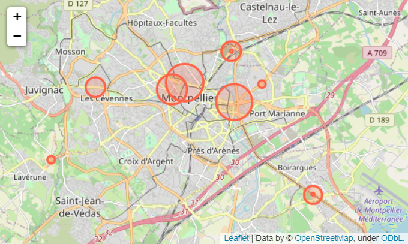

# Challenge

&nbsp;
The goal of this project is to make a prediction and a visualization.

&nbsp;
For the **prediction part**, we will use the data from https://docs.google.com/spreadsheets/d/e/2PACX-1vQVtdpXMHB4g9h75a0jw8CsrqSuQmP5eMIB2adpKR5hkRggwMwzFy5kB-AIThodhVHNLxlZYm8fuoWj/pub?gid=2105854808&single=true&output=csv (see also https://compteurs.velocite-montpellier.fr/communautaire/albert) to predict the number of bicycle passing between 00:01 AM and 09:00 AM on Friday, April 2nd, at the "Albert 1er" station.  

All the images of the prediction are available in the vis repository.  

&nbsp;
For the **visualization part**, we will use the data from http://data.montpellier3m.fr/dataset/comptages-velo-et-pieton-issus-des-eco-compteurs/resource/75f5e367-99fb-482f-ba5c to visualize the bike traffic in Montpellier.

&nbsp;
To see the visualization with Jupyter nbviewer you can click on the image.  
Otherwise to see the visualization with Binder you can click on the incone "binder" below the image (available for google chrome, internet explorer and microsoft edge, for firefox read below).  
The page may take some time to start and you may have to trust the notebook to see the map.   
The source is available in the notebooks repository at `.ipynb` format.

  

If you use firefox the link to Binder is the following : https://hub-binder.mybinder.ovh/user/lauraelkaim-challenge_prediction-ekc6odca/notebooks/notebooks/mymap.ipynb  
The page may take some time to start and you may have to trust the notebook to see the map. If a message appears you can click on "here" to be redirected to the good link.

&nbsp;
To compile the `script.py` file you can clone the git repository or download the bikeprediction package available at the following link : https://test.pypi.org/project/bikeprediction-ek/0.0.1/  
The `requirements.txt` file contains all the python packages you will need to compile this script.